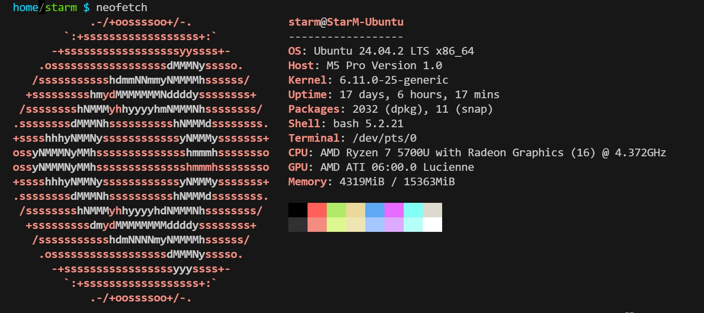
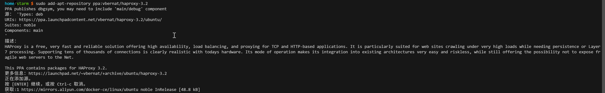
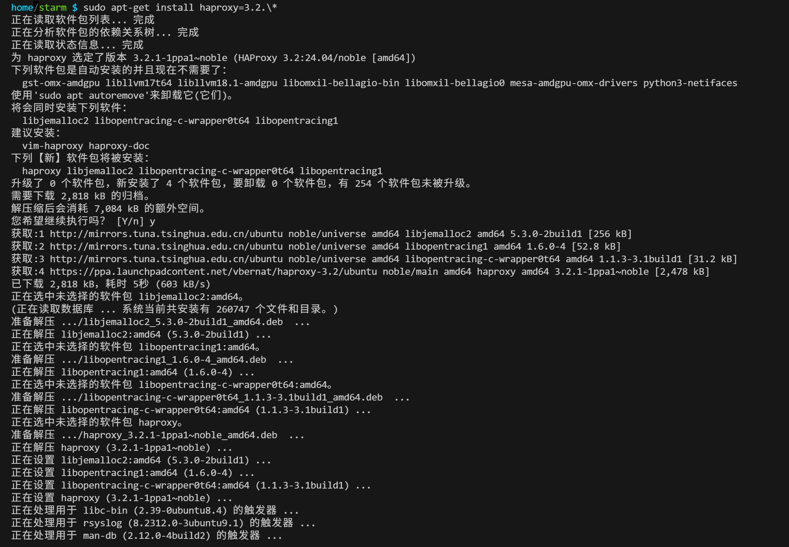
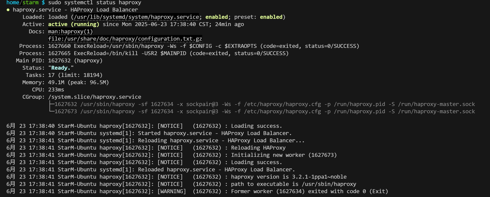
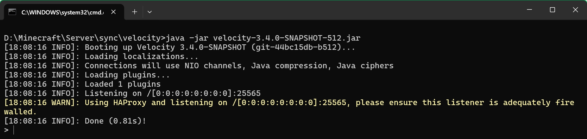

# 为群组服务器配置反向代理

## 1. 架构示例


### 1.1 HAProxy简介

**HAProxy 是一款高性能、开源的负载均衡器和反向代理软件。**

### 1.2 安装HAProxy

由于HAProxy只有Linux版本 这里使用Ubuntu 24.04.2 LTS 其它Linux发行版请自行查看
[软件包列表](https://github.com/haproxy/wiki/wiki/Packages)


添加源
```shell
sudo add-apt-repository ppa:vbernat/haproxy-3.2
```

安装
```shell
sudo apt-get install haproxy=3.2.\*
```


### 1.3 配置HAProxy

配置文件位于/etc/haproxy/haproxy.cfg
首先修改该文件权限
```shell
 sudo chmod 777 /etc/haproxy/haproxy.cfg
```
然后使用vim编辑该配置文件
```shell
vim /etc/haproxy/haproxy.cfg
```

按 i 进入编辑模式

将mode修改为tcp

添加反向代理配置
```shell
listen velocity
       #对外开放的端口
       bind *:25565
       #代理的服务端名称 服务端ip和端口 启用Proxy Protocol v2转发真实IP
       server velocity 192.168.5.10:25565 send-proxy-v2 
       
```
按esc退出编辑模式 输入:wq回车 退出并保存


### 1.4 启动HAProxy

使用systemctl启动
```shell
sudo systemctl start haproxy
```


查看运行状态
```shell
sudo systemctl status haproxy
```


## 2. 配置Velocity

### 2.1 启用HAProxy
在velocity.toml中找到haproxy-protocol 改为true

然后重启或启动 Velocity


## 3. 测试连接

输入部署了HAProxy的服务器的域名或IP 由于端口使用MC默认端口25565所以不必填写


