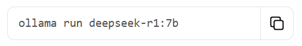

# 在Windows上部署

本文只针对N卡 其它显卡请自行查找方法
网络问题也请自行解决

本文使用环境<br>
系统: Windows 10 IoT 企业版 LTSC 21H2<br>
CPU: AMD Ryzen 7 5800H<br>
内存: DDR4 3200Mhz 16G x2<br>
GPU: NVIDIA GeForce RTX 3060 Laptop<br>
### 1. Ollama
<br>

#### 1.1 Ollama简介
Ollama 是一个开源的轻量级框架，旨在帮助用户**在本地计算机上快速部署和运行大型语言模型（LLMs）**，无需依赖云端服务。它专注于简化模型的下载、配置和交互流程，尤其适合开发者、研究人员或对隐私和数据控制有要求的用户。(由deepseek-r1生成)
#### 1.2 安装[Ollama on Windows](https://ollama.com/download/windows)
点击Download下载

安装ollama 一直点install即可

安装完成后 按Win+R输入cmd 回车 打开命令行

输入`ollama -v`验证安装
```
ollama -v
```


#### 1.3 安装模型
ollama提供了一个[模型库](https://ollama.com/search)

找到你需要的模型 这里选择deepseek-r1

根据你的需求选择不同参数量的模型 理论上选择比自己显存小的即可 但是6G显存也是可以跑7b的 只是非常极限 在爆显存的边缘

这里选择7b

点击右侧图标复制命令

回到cmd 粘贴命令 然后等待下载

下载完成后即可使用


按Ctrl+D或者输入/bye关闭


使用`ollama run deepseek-r1:7b --verbose`可以显示性能信息
```
ollama run deepseek-r1:7b --verbose
```

### 2. Chatbox
在命令行中使用终归还是有些不方便的 所以我们把ollama接入其它工具中 这里使用Chatbox
#### 2.1 Chatbox简介
Chatbox AI 是一款 AI 客户端应用和智能助手，支持众多先进的 AI 模型和 API，可在 Windows、MacOS、Android、iOS、Linux 和网页版上使用。

#### 2.2 安装[Chatbox](https://chatboxai.app/zh)
点击下载

一直点击下一步即可

点击完成

选择使用自己的API Key或本地模型

选择Ollama API

选择模型 点击保存

即可开始使用
