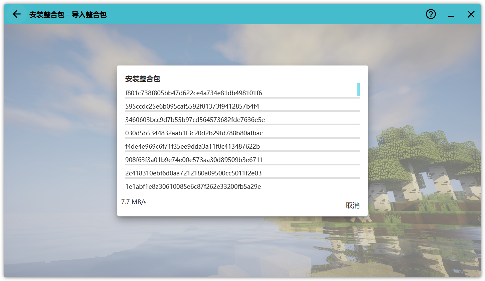

# 安装客户端

### 安装启动器
首先需要安装如HMCL,PCL2,MultiMC,Prism Launcher等支持安装.mrpack文件的启动器 

###### [下载HMCL](https://hmcl.huangyuhui.net/download/)  [下载PCL2](https://afdian.net/a/LTCat/) [下载MultiMC](https://multimc.org/) [下载Prism Launcher](https://prismlauncher.org/)

### 安装客户端

##### 以HMCL为例
把.mrpack文件拖入HMCL中

点击安装

等待下载 由于众所周知的原因导致大陆地区可能下载较慢或下载失败

安装成功

然后点击启动游戏等待启动即可

