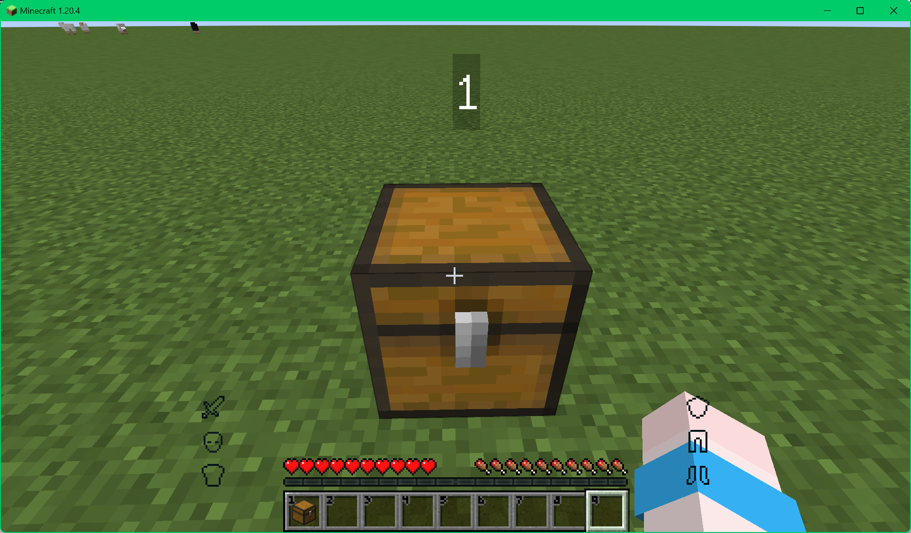
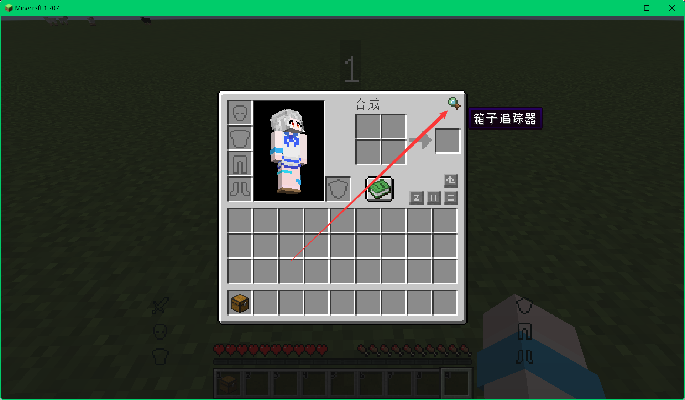
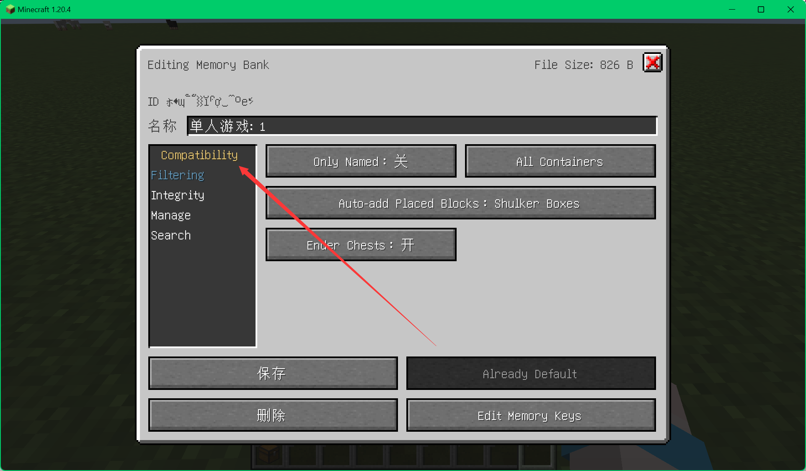
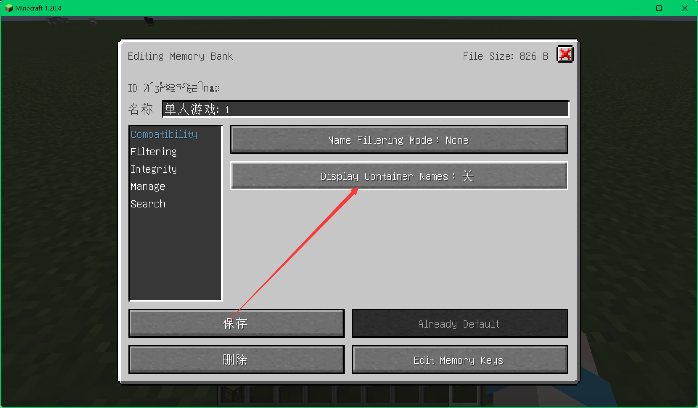
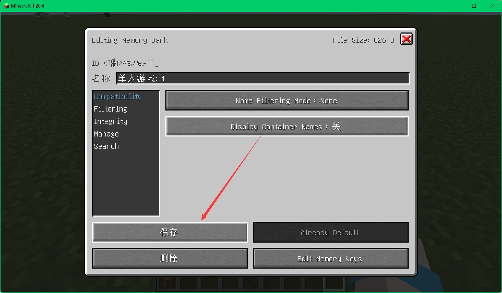
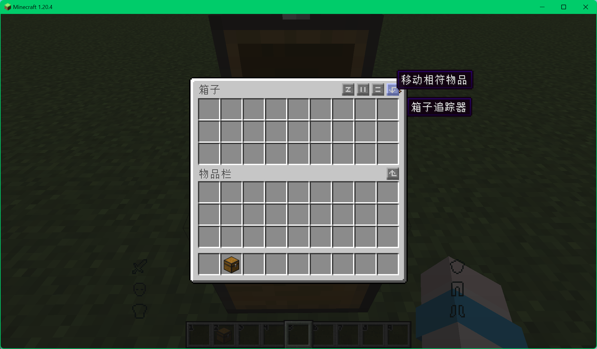
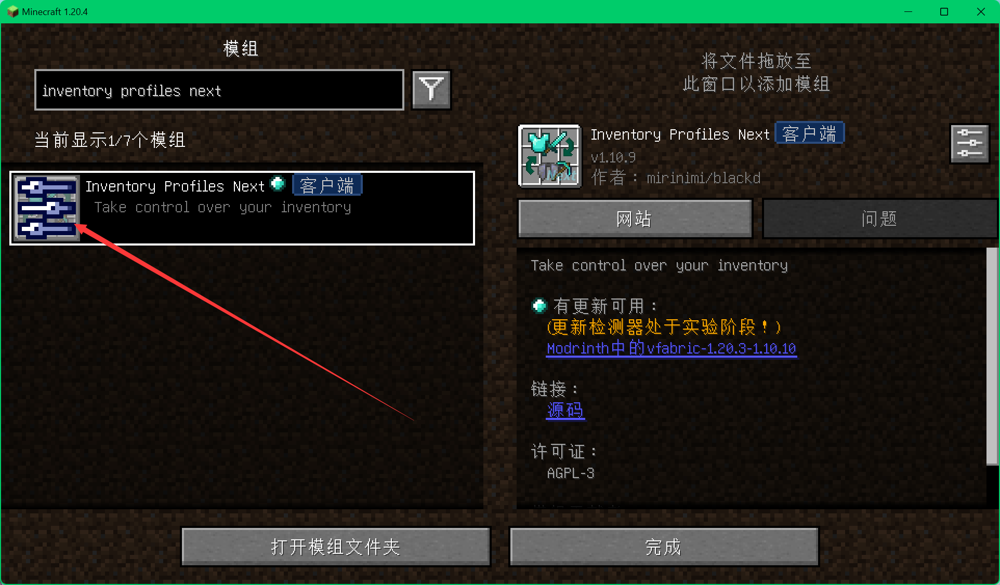
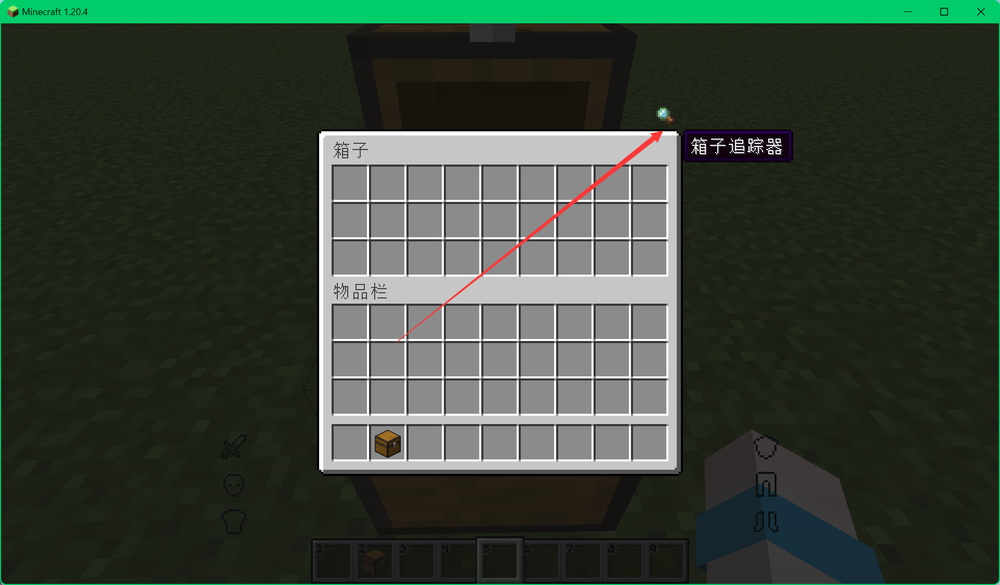

# Chest Tracker 箱子物品查找

### 关闭箱子等容器上显示名字功能
仅2.0版本(StarM Client 1.20.4)以上版本 
 
之前版本已默认关闭

##### 在箱子 潜影盒等容器上会显示容器名字

##### 在背包或任一容器界面找到该mod的按钮

##### 进入设置

##### 进入Compatibility选项卡

##### 关闭显示名字

##### 保存

##### 成功关闭

### 解决和一键整理mod按钮冲突问题

##### 在设置-模组中搜索InventoryProfilesNext

##### 在GUI中关闭物品栏按钮

##### 打开箱子等容器 左键按住箱子物品查找的图标并拖动到其它位置

##### 重复第二步再开启一键整理的物品栏按钮即可