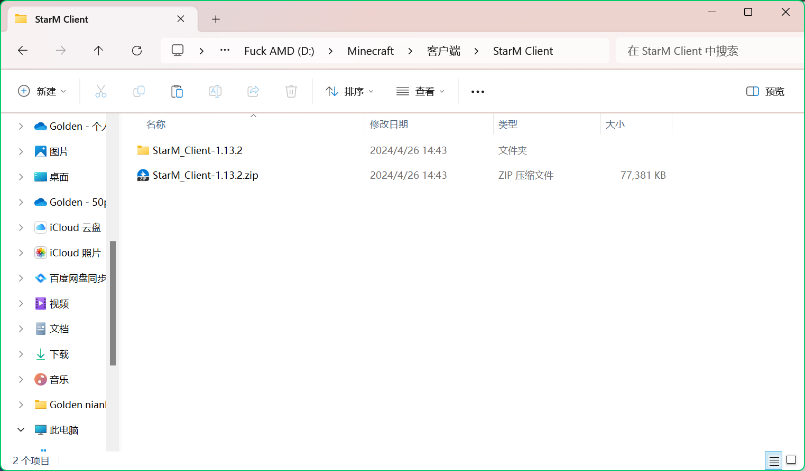
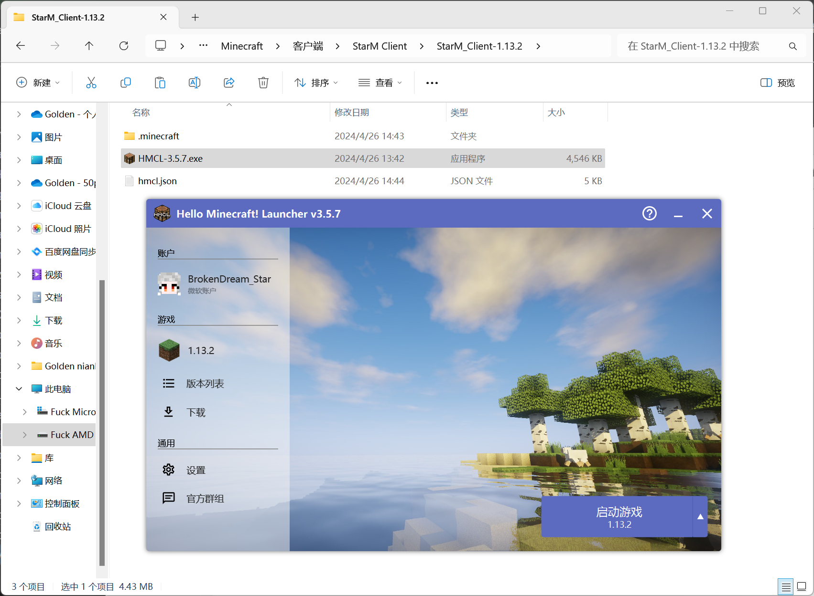
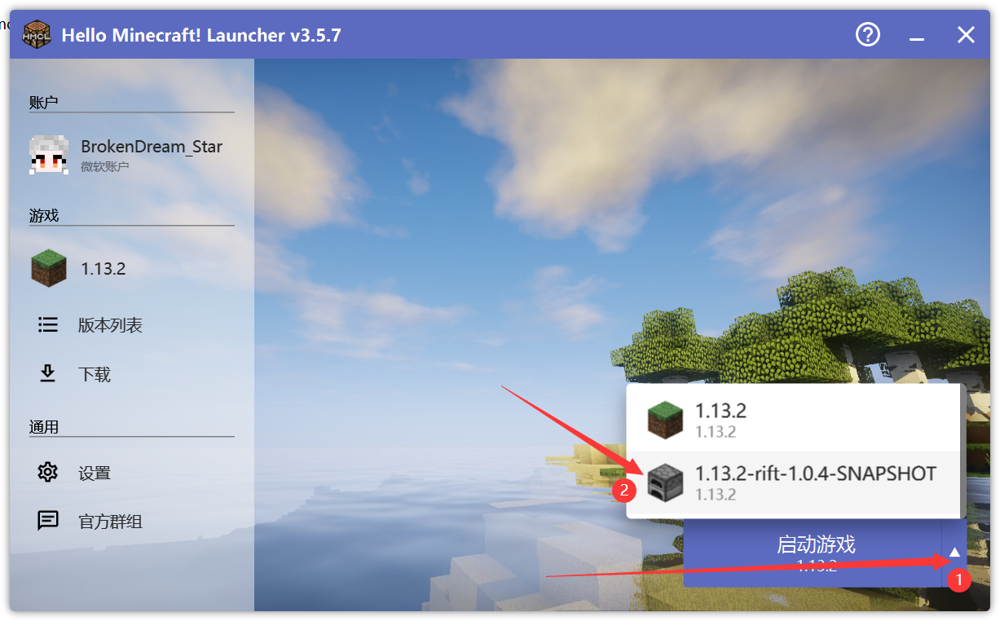
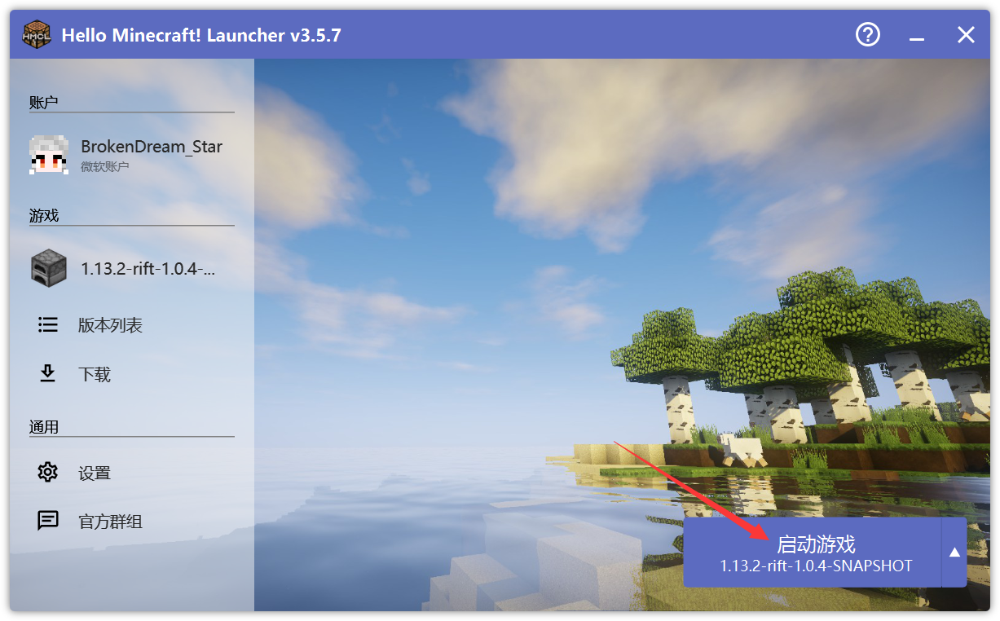
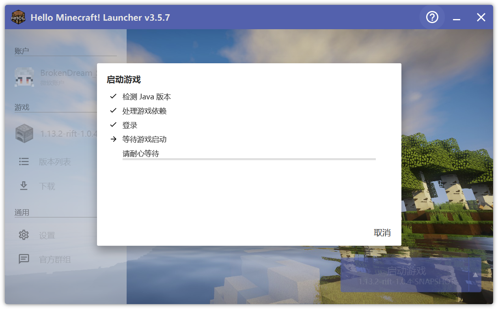

# StarM Client 1.13.2

### 简介
使用Rift，包含Masa全家桶，小地图等常用功能性mod，使用OptiFine优化 
[客户端详情](https://starm.team/#/downloads/mc/clientinfo/1.13.2)

### Java版本
1.13.2要求最低Java版本为Java8 [下载Java8](https://www.oracle.com/cn/java/technologies/downloads/#java8)

### 默认配置
 

#### 材质
默认启用Masa汉化材质，XK红石显示，XK超护眼材质，Clear Glass Pack(无缝玻璃材质)，无缝玻璃材质附加包

### 安装教程

因为Rift的特殊性 无法打包为.mrpack安装包，打包为其它格式的安装包也都有些问题，因此只能使用普通的压缩包格式

下载StarM_Client-1.13.2后解压 (解压还要我教你?)

进入StarM_Client-1.13.2文件夹打开HMCL启动器

点击启动游戏右边的箭头选择Rift

点击启动游戏等待下载补全文件

等待游戏启动

